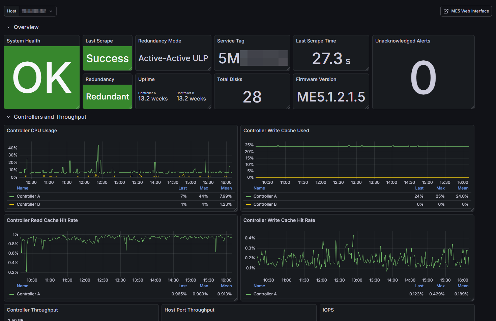

[](https://codecov.io/gh/edingc/powervault_me5_exporter)
[](https://goreportcard.com/report/github.com/edingc/powervault_me5_exporter)

# Dell PowerVault ME5 Prometheus Exporter

A Prometheus exporter for the Dell PowerVault ME5 series REST API, heavily influenced by the patterns of the official [node_exporter](https://github.com/prometheus/node_exporter/).

## AI Disclaimer

Portions of this repository were generated with the help of AI tools. Please see [AI_DISCLAIMER](AI_DISCLAIMER.md) for more information. 

## Installation

Download the [latest release](https://github.com/edingc/powervault_me5_exporter/releases). 

The example systemd files are based on Debian Prometheus conventions, and assume the exporter will run as an unprivileged user `prometheus` and be configured with the `/etc/default/prometheus-powervault-me5-exporter` file.

## Usage

The exporter must run from a system with access to the PowerVault controller web interface/API. A PowerVault system user with "monitor" privileges should be used. To create such a user, reference the [PowerVault documentation](https://www.dell.com/support/manuals/en-us/powervault-me5084/me5_series_ag/managing-local-users?guid=guid-45c5c9f8-adca-4225-9440-9c03dfae62ce&lang=en-us).

Configure the systemd files as required, or run the binary with the minimum required options for connecting to a PowerVault controller with a self-signed certificate:

```bash
ME5_USERNAME=prometheus
ME5_PASSWORD=password
./prometheus-powervault-me5-exporter --me5.host 192.168.1.1 --me5.insecure-skip-verify
```

_The exporter should always be pointed at the "A" controller's API._

Run the exporter with the `--help` flag for more information.

The following scrape configuration assumes Prometheus and the exporter are running on the same system:

```yaml
scrape_configs:
  - job_name: powervault_me5_exporter
    scrape_interval: 120s
    scrape_timeout: 60s
    static_configs:
      - targets:
          - localhost:9850
        labels:
          host: 192.168.1.1
```

### Docker

You must pass flags and the credentials to the container.

```bash
docker run -d \
  -p 9850:9850 \
  --name prometheus-powervault-me5-exporter \
  -e ME5_USERNAME='your_username' \
  -e ME5_PASSWORD='your_password' \
  edingc/prometheus-powervault-me5-exporter --me5.host=192.168.1.100 --me5.insecure-skip-verify
```

## Collectors

Collectors are enabled or disabled via `--collector.<name>` and `--no-collector.<name>` flags.

A full scrape of the PowerVault API with all collectors enabled can take up to 45 seconds to complete.

PowerVault tiers and tiering statistics are currently not supported.

| Name | Description | Default |
|---|---|---|
| `alerts` | Collect alert counts by severity. | Enabled |
| `controller_date` | Collect controller date/time and NTP metrics. | Enabled |
| `controller_statistics` | Collect controller I/O statistics. | Enabled |
| `controllers` | Collect controller metrics. | Enabled |
| `disk_group_statistics` | Collect disk group I/O statistics. | Enabled |
| `disk_groups` | Collect disk group metrics. | Enabled |
| `disk_statistics` | Collect per-disk I/O statistics. | Enabled |
| `disks` | Collect disk metrics. | Enabled |
| `enclosures` | Collect enclosure metrics. | Enabled |
| `events` | Collect event counts by severity. | Disabled |
| `fans` | Collect fan metrics. | Enabled |
| `firmware_bundles` | Collect firmware bundle info. | Enabled |
| `frus` | Collect FRU status metrics. | Enabled |
| `host_port_statistics` | Collect host port I/O statistics. | Enabled |
| `pool_statistics` | Collect pool I/O statistics. | Enabled |
| `pools` | Collect pool metrics. | Enabled |
| `ports` | Collect port metrics. | Enabled |
| `power_supplies` | Collect power supply metrics. | Enabled |
| `sensors` | Collect sensor status metrics. | Enabled |
| `service_tag` | Collect enclosure service tag info. | Enabled |
| `sessions` | Collect active session count. | Enabled |
| `snapshot_space` | Collect snapshot space metrics. | Enabled |
| `system` | Collect system-level metrics. | Enabled |
| `volume_statistics` | Collect volume I/O statistics. | Enabled |
| `volumes` | Collect volume metrics. | Enabled |

## Example Grafana Dashboard

An example Grafana dashboard can be found in `docs/dashboards`.



## Build from Source

To produce the `prometheus-powervault-me5-exporter` binary:

```bash
make build
```
